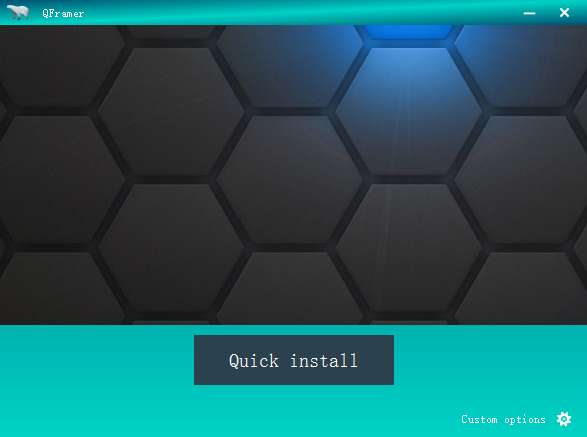
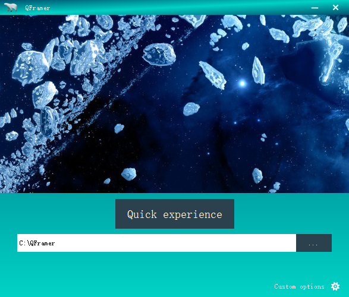
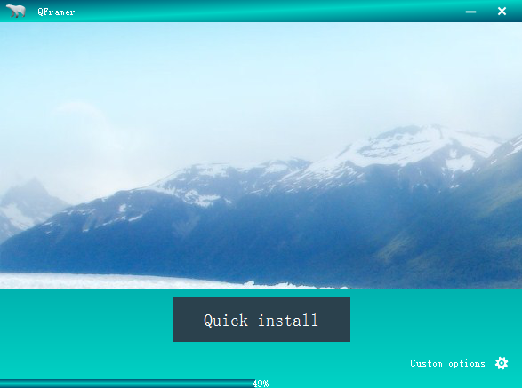
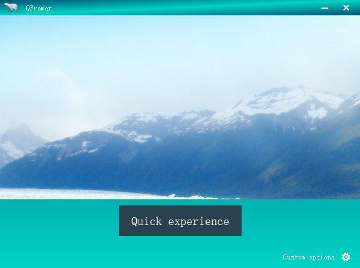

QSetuper
======
####1.Introduction
QSetuper is an tool  application like  nsis or inno setup,  but this is an c++ application based in Qt. With this tool, you can make your custom installer by yourself.

####2.Feature

+ custom ppt show
+ custom output directory
+ custom progress bar
+ open application when finished
+ create desktop link
+ ....

####3.Screenshot

####3.How
1. move you application to example directory
2. python 7z-rcc.py
3. open QSetup.pro with Qt Creater, **you should work with Qt static release version**, Just do it as you know.

